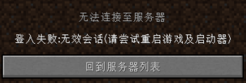
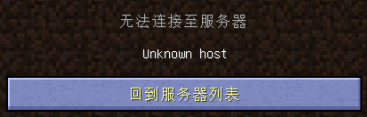
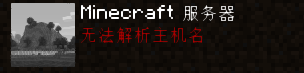
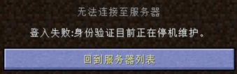
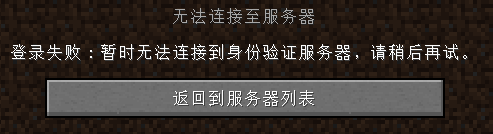
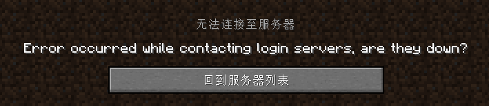
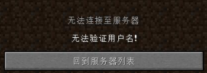
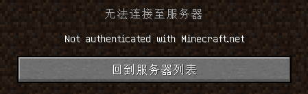
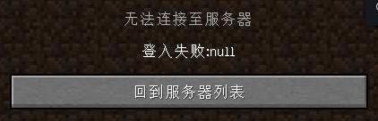
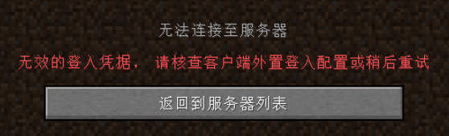

# 常见问题

## 登入失败：无效会话（请尝试重启游戏及启动器）



（原因：玩家与认证服务器断开导致）解决：将启动器上的账户删除并重新添加账户再进入游戏即可解决 PS:**首先你需要先确定你是用皮肤站登陆进入**

## Unknown host（**界面显示无法解析主机**）

[【win7百度版教程链接】](https://jingyan.baidu.com/article/f71d60375584591ab641d13c.html)[【win10百度版教程链接】](https://jingyan.baidu.com/article/2fb0ba40833b0a00f2ec5f28.html)






- 一者服务器没开、二本地设置问题、三是你的DNS的问题、四网络设置问题

### 本地设置问题

- 先进入一遍单人世界，进入退出再进多人，这样就可以解决你的问题了.

### DNS问题

- 首先你要找到DNS在哪修改（自行百度），选中 `Internet 协议版本 4（TCP/IPv4）`，再点 `属性`，选中 `使用下面的DNS服务器地址`，填写首选DNS服务器（根据你的网络服务提供商以及所在的城市百度搜索）和备用DNS服务器推荐：

```
1.0.0.1
223.5.5.5
```

- 然后点击 确定。至此DNS修改完毕

### 网络设置问题

- 打开电脑的CMD（管理员）输入`netsh winsock reset`（按回车键执行命令），然后重启电脑

## 认证服务器处于宕机状态中。请稍后重试抱歉！





- 更新JAVA并启用它，这是你JAVA版本过低导致的，可以[**[点我下载最新JAVA]**](https://en.vessoft.com/software/windows/download/java)
- 或者将启动器上的账户删除并重新添加账户再进入游戏
- 这个可能是认证服务器处于高峰期（网络拥堵、网站维护等）导致的，你可稍等片刻

## Error occurred while contaoting login servers, are they down? 



- 你需要重新登录启动器上的账户并重启游戏即可

## 无法验证用户名

- Not authenticated with Minecraft.net
- 登入失败:Null







- 请使用我们的 [**VLssuSKIN 皮肤站**](./tutorials/reg-skin-station.md) 进行登录（**离线用户注册账户并验证邮箱后**就可以和**和正版一样的体验来游玩我们的服务器**）

## 无效的登入凭据,请核查客户端外置登入配置或稍后重试



### 现知触发原因：
- 现阶段访问皮肤站的IP和进我的世界服务器的IP不对，就会被t不让进
- 服务器配置错误，反馈给管理人员修复（但基本不会出现）

## 断开连接

- 可以进入服务器，但没过多久断开连接

### 现知触发原因：
- 开了加速器或梯子但并未正常退出导致网络出现问题，重新打开加速器或梯子并通过软件进行软关闭，若还是无法解决可参考 [网络设置问题](#网络设置问题) 进行解决

## 无法连接服务器

- 可以尝试使用手机的数据网来进入服务器，可能是你当地运营商的大内网出问题了，一般无解，换运营商是最好的选择。

## 如果没有你遇到的问题可以在QQ群中询问我们 

[QQ群 - VLssu公益服](https://jq.qq.com/?_wv=1027&k=0anjDlw3)
