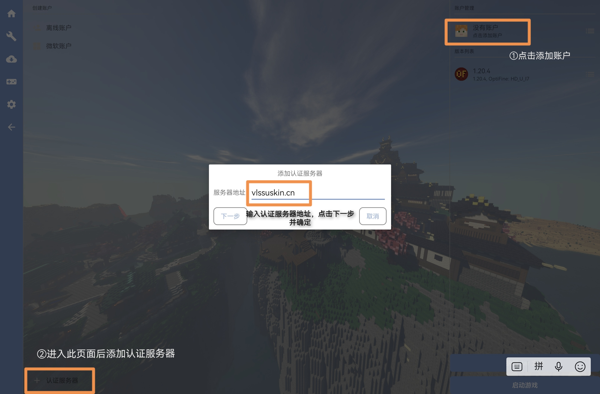
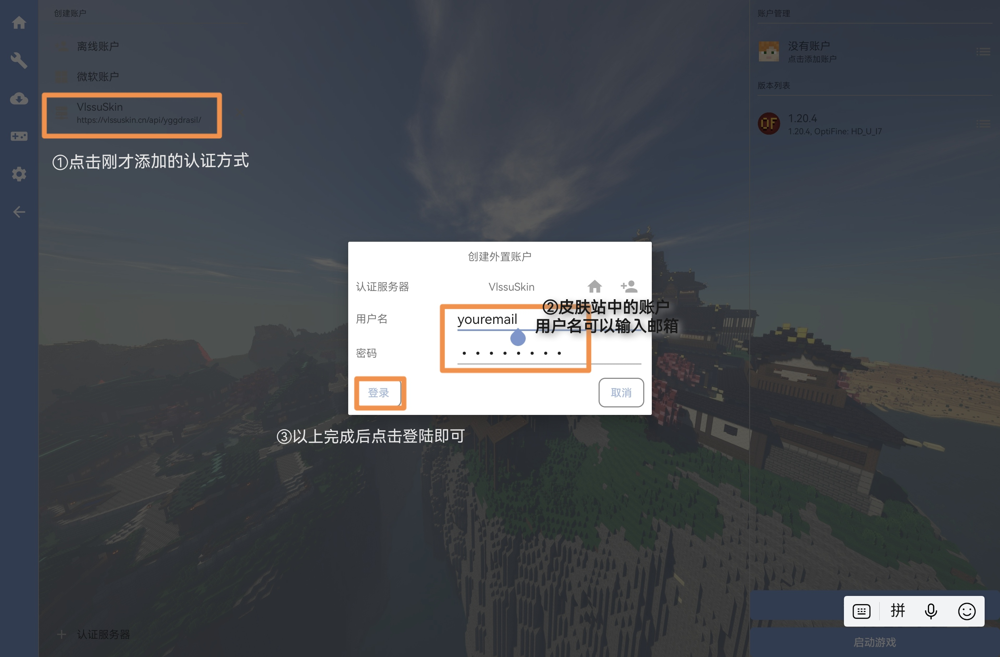
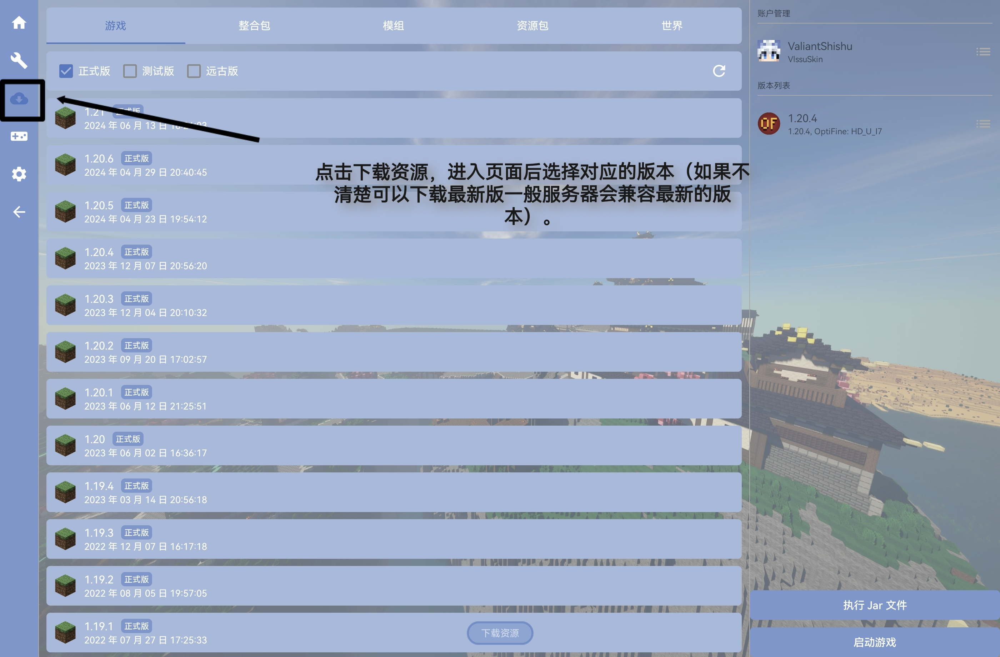
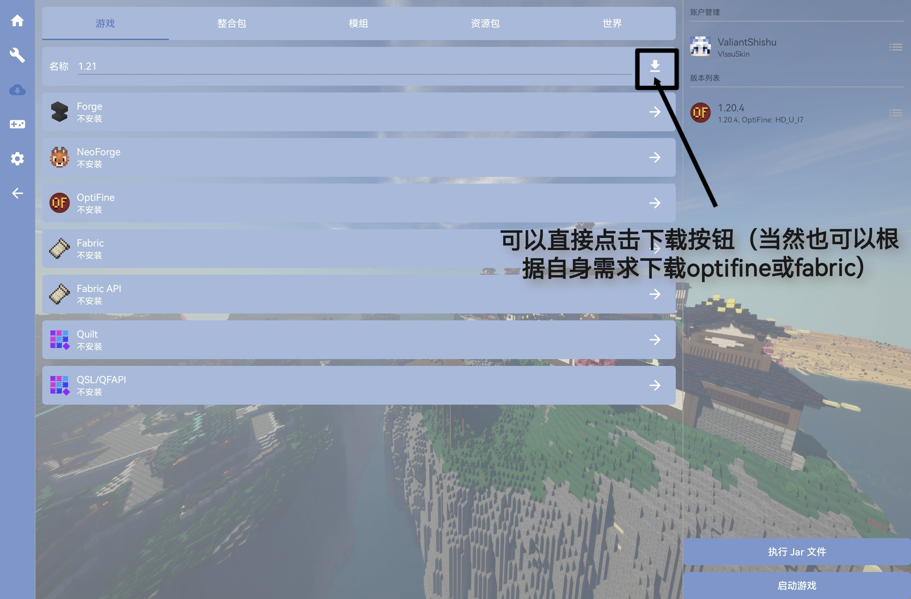
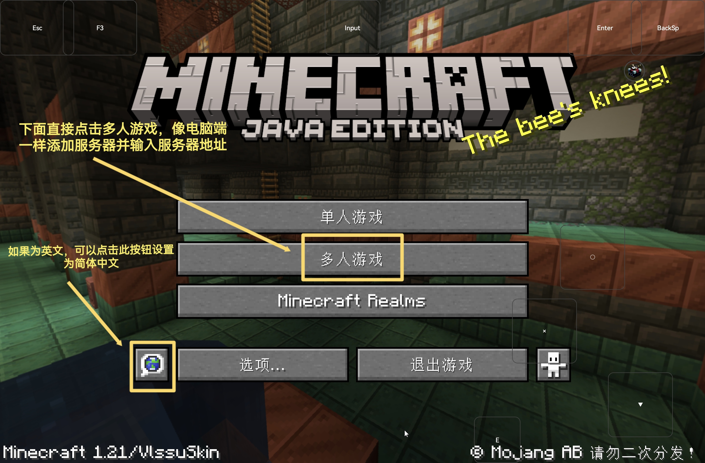

# FCL启动器
以下以 [Fold Craft Launcher](https://github.com/FCL-Team/FoldCraftLauncher) 为例，演示在手机上的 Minecraft 客户端中使用 Yggdrasil

:::tip
打开 FCL 的「点击添加账户」界面。
:::



:::tip
点击左下角的「认证服务器」，输入 VlssuSkin 的 Yggdrasil API 地址，点击「下一步」，等待识别出 VlssuSkin 的 Yggdrasil 后点击「完成」。 如果你曾经添加过 VlssuSkin 的 Yggdrasil，你也可以在「添加账户」菜单中直接选择 VlssuSkin。
```
https://skin.vlssu.com/api/yggdrasil
```
:::



:::tip
在「添加账户」菜单中选择 VlssuSkin，填写你的邮箱和密码。「用户名」即为你在 VlssuSkin 的账号的邮箱。 
:::





:::tip
在「下载资源」菜单中选择你要下载的JAVA版本，如果不清楚下载什么版本可以查看服务器对应子服说明（当然可以下载当前最新稳定版）  
如果你需要光影可自行点击optifine并安装（因设备原因，不是所有光影都能用），然后就可以点击下载名称旁的下载按钮
:::

### 设置完成啦！你可以启动游戏了



:::tip
如果为英文可以点击左下角的地球，设置为简体中文，然后点击多人游戏添加我们的服务器IP（MC.VLSSU.CN）即可游玩服务器啦（如果发现无法调出软键盘，在页面的正中间最上面有「input」既可调出）
:::

### 你可以畅玩服务器啦
