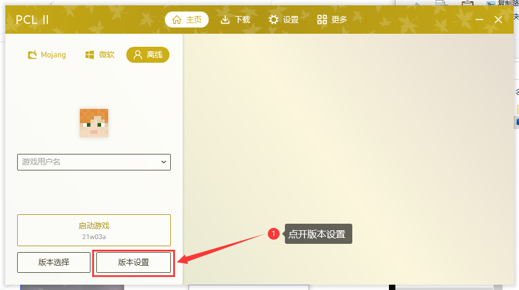
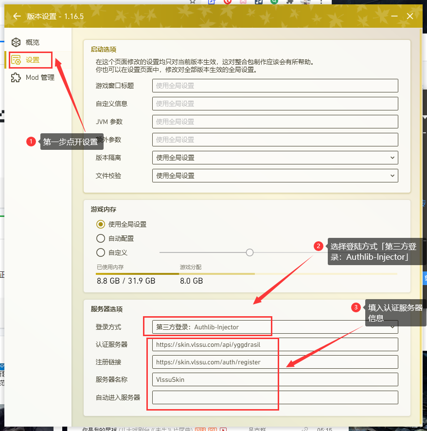
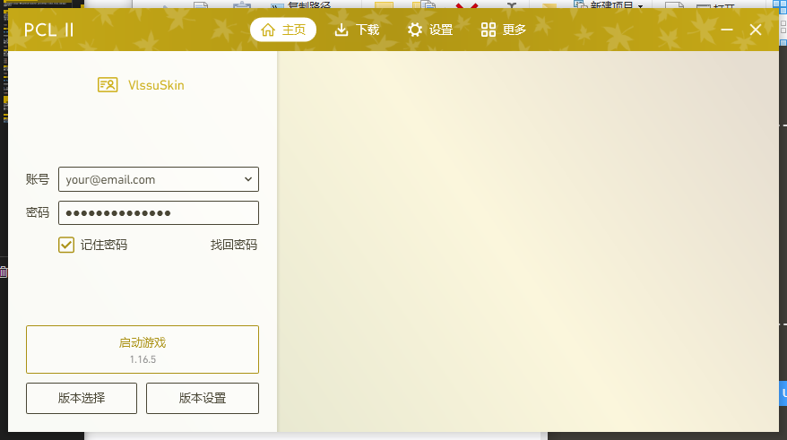

# PCL启动器
以下以 [PCL 2](https://afdian.net/@LTCat) 为例，演示在 Minecraft 客户端中使用 Yggdrasil

:::tip 小小的建议
该启动器可能存在反人类设计或其他一些原因，在此我们不太推荐使用此启动器，建议使用其他启动器。**如果您觉得此提示不当，请无视此提示。**
:::

:::tip
打开 PCL 2 的「版本设置」界面。如果这是你第一次打开 PCL 2，请先下载你想玩的版本(或服务器所需版本)
:::



:::tip
点击「设置」往下拉动会看见「服务器选项」，在「登陆方式」一栏选择「第三方登录：Authlib-lnjector」，下面会弹出「认证服务器」等一系列选项。输入 VlssuSkin 的 Yggdrasil API 地址等信息
:::

:::caution
由于PCL2作者设计原因，每玩一个新版本都需要如此设置
:::

```
登陆方式    第三方登录：Authlib-lnjector
认证服务器  https://skin.vlssu.com/api/yggdrasil
注册链接    https://skin.vlssu.com/auth/register
服务器名称  VlssuSkin
```



:::tip
在新版 PCL 这里左下角会有「设置为 Little Skin」，**请不要点击，直接左上角点返回即可**。
:::

:::tip
设置好后主页不出意外已经自动变成VlssuSkin设置界面了，在下方填写你的邮箱和密码。「账户」即为你在 VlssuSkin 的账号的邮箱。

因PCL2作者设计原因，认证服务器只能设置一个，在不更改(没有输错)的情况下，那 VlssuSkin 就是启动器唯一的认证服务器
:::



### 设置完成啦！你可以直接点「启动游戏」了，账户会直接登录
