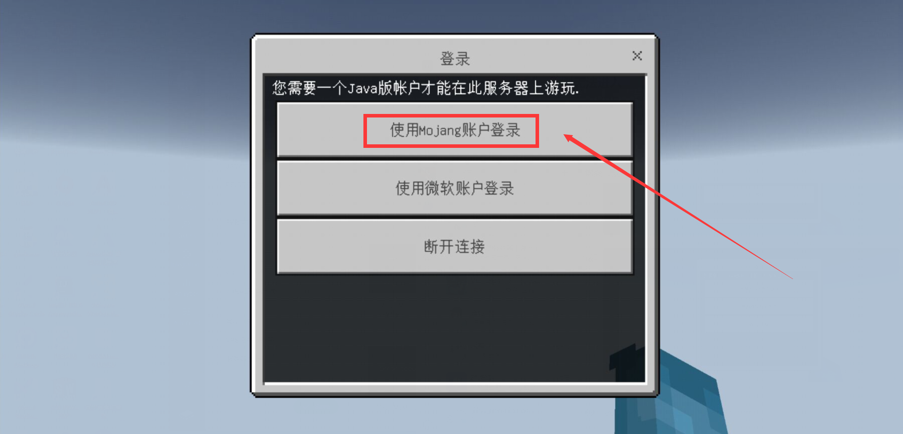
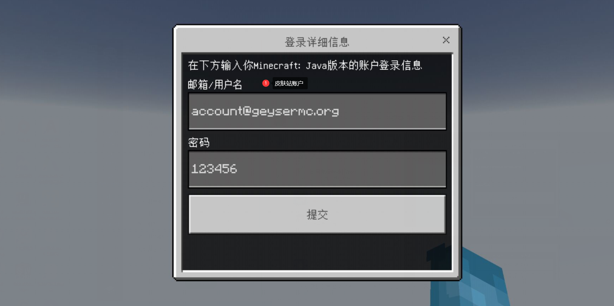

# PE/BE/基岩版
这里讲述了基岩版该如何配置

## 首先进入QQ群或网盘中下载基岩版
当然你可以用自己的基岩版，版本需：**1.20.0 - 1.20.30**

[QQ群 - VLssu公益服](https://jq.qq.com/?_wv=1027&k=0anjDlw3)

## 注册皮肤站账户

[如何注册皮肤站](../reg-skin-station.md)

## 添加服务器IP等信息

[点此链接自动跳转基岩版客户端](minecraft://?addExternalServer=Vlssu%20Server%7Cmc.vlssu.cn:19132)

:::tip 如果链接失效可以手动输入
mc.vlssu.cn 端口默认即可（19132）
:::

## 使用皮肤站账户登录

在此之前请先登录微软账户，然后通过以上地址进入服务器后会出现以下内容，按照图中所示即可

