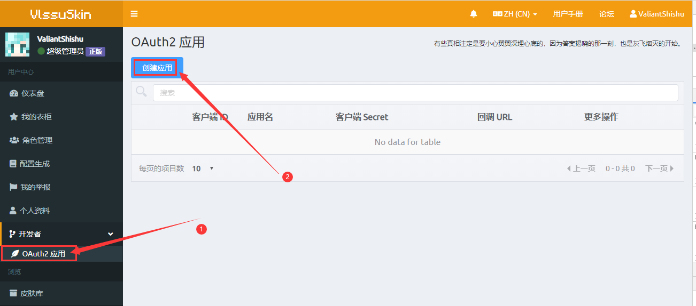
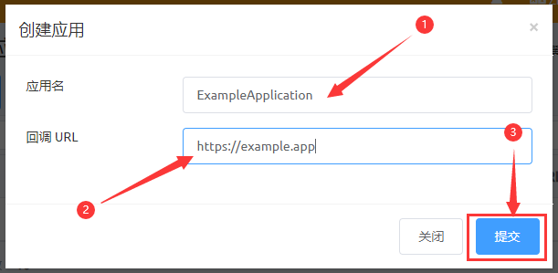

# OAuth 2
:::tip
这篇文档是面向开发者的，普通用户可能无法理解。

如果你看不懂这个页面在说些什么，直接关闭这篇文档或者浏览其它文档即可，忽略这部分内容不会影响你正常使用 VlssuSkin 的基础功能。
:::
VlssuSkin 支持 OAuth 2 服务端。你可以在你的应用中集成「使用 VlssuSkin 账户登录」这样的功能。

## 文档
请参阅：[Blessing Skin API 文档 - OAuth2 认证。](https://blessing.netlify.app/api/oauth.html)

## 创建 OAuth 2 应用
在你的网站中集成 OAuth 2 之前，你需要先在 VlssuSkin 创建应用并获取客户端 ID 和客户端 Secret。

1. 打开 OAuth 2 应用管理页面，你可以在侧边栏的 开发者 -> OAuth2 应用 找到这个页面的链接。点击「创建应用」。

2. 输入你的应用的名称和回调 URL，点击「提交」。

3. 你的 OAuth 2 应用就创建好啦，你可以在页面中找到你的 OAuth 2 应用的客户端 ID 和客户端 Secret。

## 第三方网站接入总结

|说明|键|值|
|:----|:----|:----|
|网站生成的ID|`client_id`|（客户端 ID）|
|网站生成的secret 值|`client_secret`|（客户端的 secret 值）|
|应用程序授权端点 URL|`authorize_url`|`https://skin.vlssu.com/oauth/authorize`|
|应用程序token端点 URL|`token_url`|`https://skin.vlssu.com/oauth/token`|
|用户信息端点 URL|`user_info_url`|`https://skin.vlssu.com/api/user`|
|包含用户 ID 的字段|`id`|`uid`|
|包含用户显示名称的字段|`name`|`nickname`|
|包含用户电子邮件地址的字段|`email`|`email`|

### OAuth2 认证说明

客户端在首次向用户请求授权时，应该让用户访问 `https://skin.vlssu.com/oauth/authorize?client_id={客户端 ID}&redirect_uri={回调 URL}&response_type=code&scope=` （最好是客户端能主动调用浏览器）。

此时浏览器会显示一个让用户选择是否允许授权给客户端的页面。如果用户允许，用户将被重定向到回调 `URL`，并带有一个含 `code` 字段的 `query string`。

客户端要取回这个 `code` 的值。

接下来，客户端用自己的 HTTP 库以 POST 方法访问（即，无需用户干预）此 URL：`https://skin.vlssu.com/oauth/token`，同时附带上以下表单参数：

|key|value|
|:----|:----|
|grant_type|authorization_code|
|client_id|（客户端 ID）|
|client_secret|（客户端的 secret 值）|
|redirect_uri|（回调 URL）|
|code|（刚刚获取到的 code 值）|
